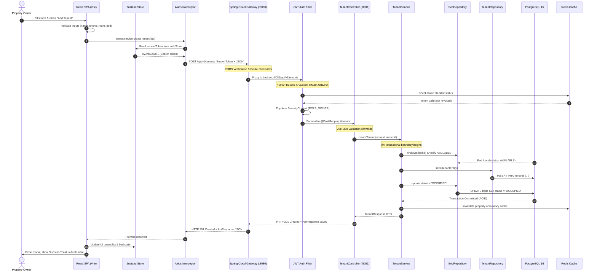

# StayHub Architectural Flow: Request Lifecycle

This document provides a comprehensive, step-by-step trace of how the entire StayHub ecosystem connects and operates. We trace the end-to-end journey of a single user action: **"Adding a Tenant"** from the React frontend, through the API Gateway, Spring Boot Security & Service layers, to PostgreSQL persistence, and back to the browser.

---

## Architecture Flow Diagram



---

## Detailed Step-by-Step Breakdown

### 1. Frontend: Form Submission & State Preparation
1. The property owner navigates to the **Tenants** page and clicks **"+ Add Tenant"**, opening `TenantModal.tsx`.
2. The user fills out the required tenant details:
   - Personal info: `firstName`, `lastName`, `email`, `phone`, `emergencyContact`.
   - Allocation: `propertyId`, `roomId`, `bedId`.
   - Lease terms: `monthlyRent`, `securityDeposit`, `checkInDate`.
3. Client-side validation verifies that email formatting is valid, phone number conforms to regional standards, and all required fields are populated.
4. When the user clicks **"Save Tenant"**, the React event handler dispatches:
   ```typescript
   await createTenant({
     propertyId,
     roomId,
     bedId,
     firstName,
     lastName,
     email,
     phone,
     emergencyContact,
     monthlyRent,
     securityDeposit,
     checkInDate
   });
   ```

### 2. Network Layer: Axios Interceptors & JWT Injection
1. The call invokes `tenantService.create(data)` in `frontend/src/features/tenants/services/tenantService.ts`.
2. `services/axios.ts` intercepts the outgoing HTTP request:
   ```typescript
   apiClient.interceptors.request.use((config) => {
     const token = useAuthStore.getState().accessToken;
     if (token) {
       config.headers.Authorization = `Bearer ${token}`;
     }
     return config;
   });
   ```
3. The HTTP `POST` request is dispatched to `http://localhost:8080/api/v1/tenants` with payload and `Authorization: Bearer eyJhbGci...`.

### 3. API Gateway: Route Resolution, CORS & Ingress
1. The request enters **Spring Cloud Gateway** running on port `8080`.
2. The gateway matches the route predicate defined in `application.yml`:
   ```yaml
   predicates:
     - Path=/api/v1/tenants/**
   uri: http://backend:8081
   ```
3. CORS configuration verifies that the origin (`http://localhost:5173`) is permitted.
4. The gateway appends telemetry headers (`X-Request-Id`, `X-Forwarded-For`) and proxies the HTTP payload downstream to the Spring Boot backend (`http://backend:8081`).

### 4. Backend Security: Filter Chain & JWT Validation
1. The incoming request is intercepted by `JwtAuthenticationFilter.java` within the Spring Security filter chain:
   ```java
   String authHeader = request.getHeader("Authorization");
   String token = authHeader.substring(7);
   String userEmail = jwtService.extractUsername(token);
   ```
2. The filter:
   - Verifies the cryptographic HMAC-SHA256 signature using the secret key (`jwt.secret`).
   - Checks that the token has not expired (`claims.getExpiration().before(new Date())`).
   - Queries Redis to confirm the token has not been revoked via logout.
   - Loads the `SecurityUser` principal and injects an `Authentication` token into the thread-local `SecurityContextHolder`.
3. Spring Security validates that the user possesses the required role authority (`ROLE_OWNER` or `ROLE_MANAGER`).

### 5. Controller Layer: JSR-380 Validation & Mapping
1. The request enters `TenantController.java`:
   ```java
   @PostMapping
   public ResponseEntity<ApiResponse<TenantResponse>> createTenant(
       @Valid @RequestBody TenantRequest request
   )
   ```
2. The Spring MVC `@Valid` annotation triggers Hibernate Validator on `TenantRequest`:
   - `@NotBlank(message = "First name is required")`
   - `@Email(message = "Invalid email address")`
   - `@NotNull(message = "Monthly rent is required")`
   - `@Positive(message = "Rent must be greater than zero")`
3. If validation fails, `GlobalExceptionHandler.java` intercepts the `MethodArgumentNotValidException` and produces a structured `400 Bad Request` with field-level errors.
4. If validation passes, execution continues to `TenantService.createTenant(request)`.

### 6. Service Layer: Business Logic & Transaction Boundary
1. `TenantServiceImpl.java` executes within an `@Transactional` database boundary.
2. **Business Invariant Checks**:
   - Confirms that the target property is managed by the requesting user.
   - Confirms that the target room exists and belongs to the selected property.
   - Queries `BedRepository.findById(request.getBedId())`.
   - **Concurrency Check**: Verifies that the bed status is currently `AVAILABLE`. If another user booked the bed simultaneously, a `BadRequestException("Selected bed is already occupied")` is raised.
3. **Entity Construction**:
   - Maps the `TenantRequest` DTO to a `Tenant` entity.
   - Sets status to `ACTIVE`.
   - Assigns a newly generated UUID (`UUID.randomUUID().toString()`).
4. **State Transition**:
   - Updates the target bed's status from `AVAILABLE` to `OCCUPIED`.

### 7. Data Persistence: PostgreSQL ACID Transaction
1. Hibernate generates and fires the SQL statements over the JDBC connection pool (HikariCP):
   ```sql
   INSERT INTO tenants (
       id, property_id, room_id, bed_id, first_name, last_name,
       email, phone, emergency_contact, monthly_rent, security_deposit,
       check_in_date, status, created_at, updated_at
   ) VALUES (
       '7a9b1c2d-3e4f-5a6b-7c8d-9e0f1a2b3c4d',
       'prop-101', 'room-201', 'bed-301', 'Rohan', 'Sharma',
       'rohan.sharma@example.com', '+919876543210', '+919876543211',
       8500.00, 17000.00, '2026-03-01', 'ACTIVE', NOW(), NOW()
   );

   UPDATE beds 
   SET status = 'OCCUPIED', updated_at = NOW() 
   WHERE id = 'bed-301';
   ```
2. PostgreSQL writes changes to Write-Ahead Logging (WAL) and commits the transaction atomically.

### 8. Cache Invalidation
1. Upon successful transaction commit, `TenantService` evicts stale cache entries in Redis:
   - Evicts keys matching `cache:property:prop-101:occupancy`.
   - Evicts keys matching `cache:property:prop-101:available-beds`.
2. This ensures subsequent dashboard and room occupancy queries immediately reflect the newly occupied bed.

### 9. Response Return & Frontend Hydration
1. `TenantMapper.toResponse(savedTenant)` converts the persisted entity into a clean `TenantResponse` DTO.
2. `TenantController` wraps the DTO in `ApiResponse.created(data, "Tenant onboarded successfully")` and returns HTTP status `201 Created`.
3. The response travels back through Spring Cloud Gateway to the client browser.
4. Axios receives the HTTP response, and the React mutation hook resolves:
   - Zustand `uiStore` triggers a success toast: *"Tenant Rohan Sharma onboarded successfully!"*.
   - The modal `isOpen` state toggles to `false`.
   - The tenant list in React state prepends the new tenant record.
   - The room bed status badge immediately updates from green (`Available`) to amber (`Occupied`).
