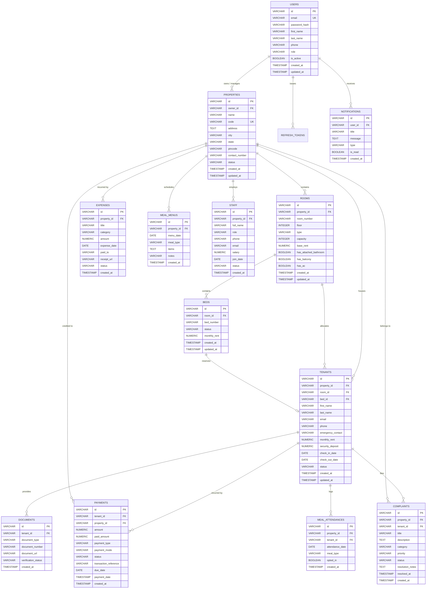

# StayHub Entity-Relationship Diagram

This document illustrates the data architecture and relational structure across PostgreSQL tables in the **StayHub** property management ecosystem.

## Relational Key Design Rules
- **Referential Integrity**: All child relationships (`rooms`, `tenants`, `payments`, `expenses`, `complaints`, `staff`) enforce `ON DELETE CASCADE` or `RESTRICT` depending on operational safety.
- **Audit Columns**: All primary domain tables maintain `created_at` and `updated_at` audit timestamps.
- **UUID Identifiers**: UUID v4 strings (36 characters) provide decentralized ID generation avoiding key collisions across distributed deployments.
