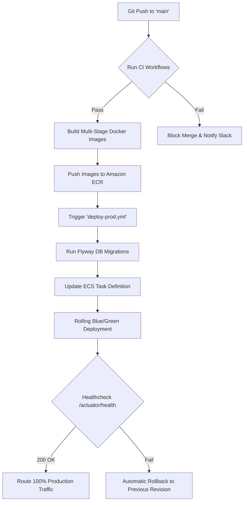

# Continuous Integration & Continuous Delivery (CI/CD)

StayHub uses GitHub Actions to automate code validation, quality gates, Docker container image publishing, and deployment workflows.

---

## 1. Workflows Overview

| Workflow | Trigger | Description |
| :--- | :--- | :--- |
| **`frontend-ci.yml`** | PR/Push to `main`, `develop` (paths: `frontend/**`) | ESLint, TypeScript `tsc --noEmit`, test suites, Vite production bundle |
| **`backend-ci.yml`** | PR/Push to `main`, `develop` (paths: `backend/**`) | Java 21 LTS setup, Maven compilation, Unit test execution, Checkstyle |
| **`gateway-ci.yml`** | PR/Push to `main`, `develop` (paths: `gateway/**`) | Spring Cloud Gateway build validation, route configuration verification |
| **`docker-build.yml`** | PR/Push to `main` | Multi-stage Docker builds for Frontend, Backend, and Gateway; image vulnerability scan |
| **`deploy-dev.yml`** | Push to `develop` | Deploys containers to development ECS Fargate cluster |
| **`deploy-prod.yml`** | Release tag / Merge to `main` | Production deployment with manual approval gates, canary rollouts, and automatic rollback on healthcheck failure |

---

## 2. Secrets & Environment Configuration

Configure the following secrets in **GitHub Repository Settings > Secrets and Variables > Actions**:

### Cloud & Registry Credentials
- `AWS_ACCESS_KEY_ID`: IAM user credentials for deployment role
- `AWS_SECRET_ACCESS_KEY`: Secret access key
- `AWS_REGION`: e.g. `us-east-1`
- `ECR_REGISTRY`: E.g. `123456789012.dkr.ecr.us-east-1.amazonaws.com`

### Application Environment Secrets
- `JWT_SECRET`: 256-bit cryptographically secure key
- `DB_USERNAME`: Production RDS database user
- `DB_PASSWORD`: Production RDS database password
- `PROD_FRONTEND_URL`: Hosted domain for CORS whitelisting (e.g., `https://stayhub.app`)

---

## 3. Deployment Flow Diagram

